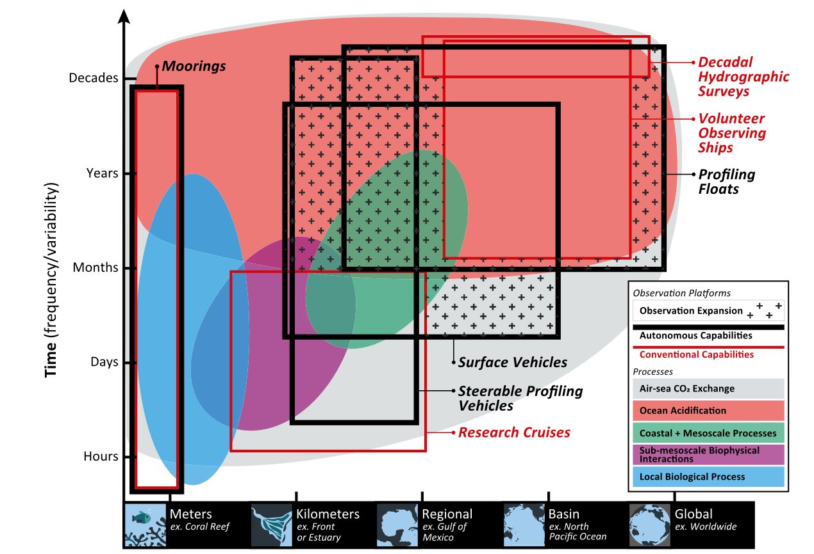
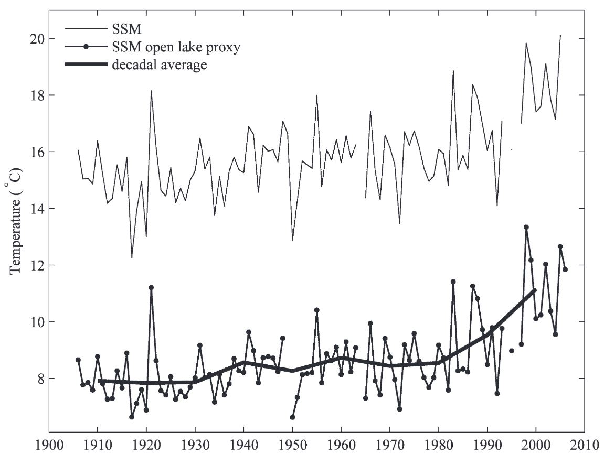
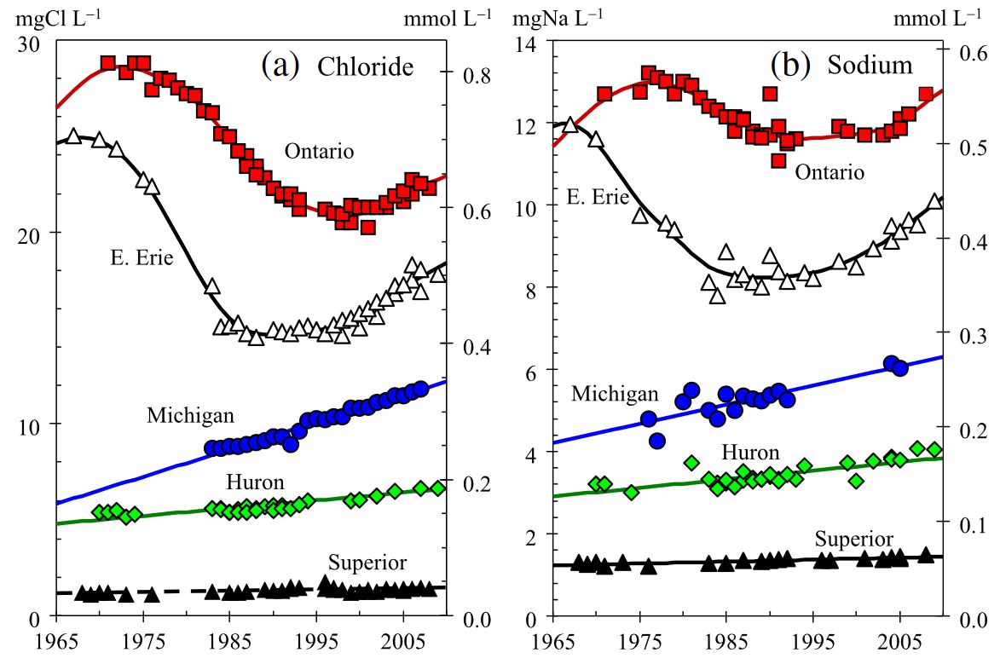
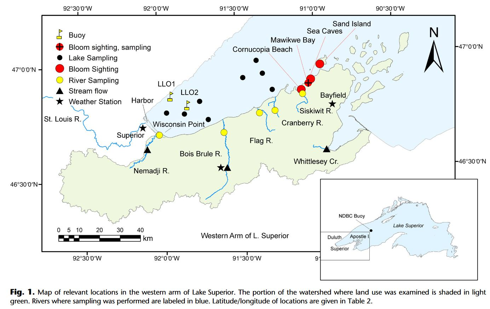
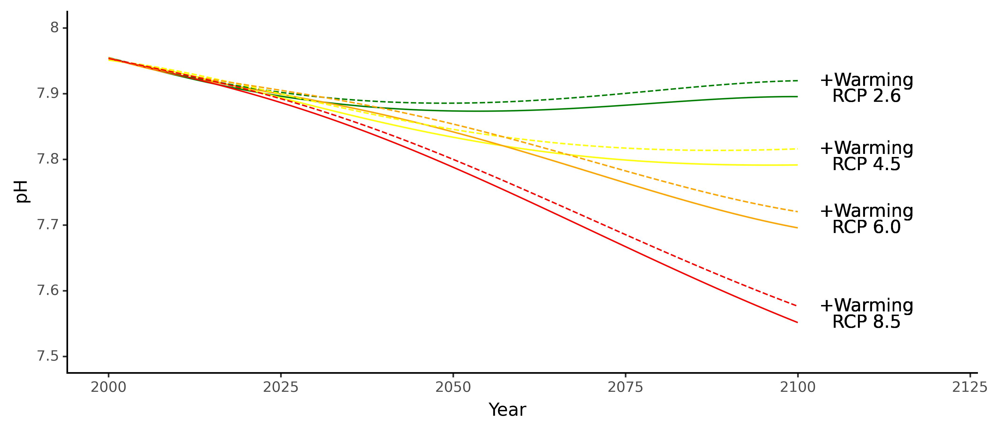
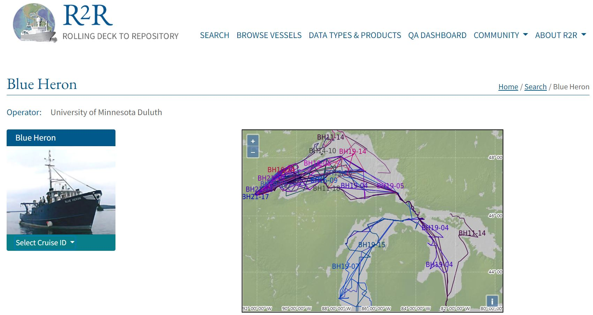

# Day of *Water* Data 2023

*Resources for participants in the University of Minnesota Day of Data 2023.*
*Created by Daniel E. Sandborn, Large Lakes Observatory, University of Minnesota Duluth*

> This matrial accompanies a talk delivered by the author at the UMN Day of Data event in January 2023.  To run the code detailed below, you have at least two options: 1. Cut-and-paste code snippets into a Python terminal of choice.  This may take the form of Spyder, Jupyter, IDLE, etc. 2. Download and run the Jupyter Notebook available (here)[link].

## Introduction to Lake and Ocean Observation Systems

Observers of lakes and oceans have a choice of many instruments and strategies, including moored instruments (buoys), research cruises, drifting buoys, autonomous profilers, and more.  Different phenomena exist on different scales, with temporal variability between seconds and millennia, and spatial variability between millimeters and thousands of kilometers.  

To observe a process, you have to match your observation strategy to phenomena of interest.

```python
# We begin by importing packages we'll need
# You may need to download some packages if they aren't already available.
# Check the package websites for details.

import pandas as pd  # for matrix manipulation
import numpy as np  # general-use numerical functions
from erddapy import ERDDAP  # for accessing buoy data directly
import geopandas as gp  # mapping toolkit
from PIL import Image, ImageDraw  # image I/O functions
import matplotlib.pyplot as plt  # highly-flexible graphing package
from scipy import optimize  # curve-fitting toolkit
```


Plotting spatial variability on one axis and temporal variability on 
the other illustrates the overlap among various ocean phenomena and observation techniques.  

## Climate, Weather, and the Laurentian Great Lakes

The Laurentian Great Lakes contain ##% of the Earth's surface freshwater despite occupying only ##% of the Earth's surface.  

They influence regional climate and weather over a large portion of North America, as evidenced by, for example, cooler temperatures near the lakes in summer, and lake effect snowfall in early winter.  

Recent research has highlighted the ways in which we are modifying the physical, chemical, and biological states of the Great Lakes.  

**Our lakes are getting warmer** (Austin and Coleman, 2008)

**Our lakes are getting saltier** (Chapra et al. 2012)

**Our lakes are experiencing unprecedented harmful algal blooms** (Sterner et al. 2020)

**Our lakes (especially the more poorly-buffered lakes like Superior) may be acidifying** (Sandborn and Minor, 2022; after Phillips et al. 2015)

This research, as well as management and policy decisions that can help mitigate harmful changes, rely upon observations spanning minutes to centuries, and creeks to continents. 

## Buoys

Moored instruments(aka buoys) are among the water scientists' most-useful tools for extended observational campaigns for many physical, as well as some chemical and biological parameters.  There wereXX moorings deployed on the Great Lakes during the 2022 field season by X organizations including universities, federal, state, and provincial agencies, and other local stakeholders.

Moorings are a treasure-trove of data, informing researchers and managers on very small spatial scales, yet with high-frequency and extended-duration data streams.  Networks of buoys (such as those coordinated by the National Data Buoy Center) can extend the scope of moored observations, but it's impractical to cover Lake Superior (let alone the global ocean) with enough moorings to observe large-scale
trends, especially in spatially-variable systems like large lakes and coasts.  

Here I'll demonstrate the use of a data access protocol to obtain real time data on wave height and temperature from a mooring maintained by the Large Lakes Observatory at the University of Minnesota Duluth.  The mooring is just north of Duluth, near McQuade Harbor.  Wave hgithe and water temperature are two physical variables particularly suited for moored observations.  They help inform our understanding of lake productivity energy and mass exchange, and -- this one is critical -- the optimal conditions for surfing on the North Shore.

Data access protocols such as this one (maintained by IOOS in partnership with NOAA) allow us to obtain high-resolution, real-time information from remote locations.  From the data scientist's perspective, however, things aren't so cut and dry as asking a server for information.  These data are subject to instrument and transmission errors, downtime, and weather/climate constraints.  

After downloading data from the Great Lakes Observing System via ERDDAP for this past summer (the mooring was retrieved in October before wave and ice action destroyed it), an anomaly is evident in the temperature timeseries: many readings of -9999K. Clearly this is an instrumental error, denoting a voltage out-of-range.  These are easily removed.

Gaps are also evident in the timeseries, sometimes lasting days.  Transmission (via a cellular network in this case) can be interrupted or disabled by any number of hardware or software issues.  The last constraint has already been hinted at: moorings are typically retrieved before winter arrives, with its high seas and crushing ice floes.  This gap in observations is a significant obstacle to understanding lake and ocean biogeochemistry.

Now we can talk about surfing.  Strong winds from the northeast are common on Lake Superior in the Fall thru Spring.  Over exceedingly long stretches of open water (e.g. over the ocean, or the line from the North Shore to the Slate Islands) the *fetch* of this wind can create surfable waves.  Surfers know to check a series of moorings stretching from Isle Royale down to Duluth to predict wave intensity days to hours in advance.

```python
e = ERDDAP( #initialize the ERDDAP interface with server details
    server="https://seagull-erddap.glos.org/erddap",
    protocol="tabledap",
    response="csv",
)

e.dataset_id = "obs_45" #provide the mooring identifier, found at the GLOS Seagull website.

e.variables = [ #provide a list of variables to download
    "time",
    "wtmp1",
    "wtmp3",
    "wtmp8",
    "wtmp13",
    "wtmp18",
    "wtmp23",
    "wtmp28",
    "wtmp33",
    "wtmp38",
    "wtmp43"
]

e.constraints = { #narrow it down to the 2022 field season
    "time>=": "2022-05-23T00:00:00Z",
    "time<=": "2022-10-7T00:00:00Z",
}


df = e.to_pandas( #download the data into a Pandas dataframe
    #index_col="time (UTC)",
    parse_dates=["time (UTC)"], #define this column as a datetime object
).dropna()

datacolumns = ['wtmp1 (K)', 'wtmp3 (K)', 'wtmp8 (K)', 'wtmp13 (K)',
               'wtmp18 (K)', 'wtmp23 (K)', 'wtmp28 (K)', 'wtmp33 (K)', 'wtmp38 (K)',
               'wtmp43 (K)']

for i in df.index: #for each row
    for j in datacolumns: #for each column in each row
        if df.loc[i, j] < 0: #if the temperature value is less than 0:
            df.loc[i, j] = np.nan #nix it and replace with a "not a number" value
df.time = df.loc[:, "time (UTC)"]

colors = iter([plt.cm.inferno(i) for i in np.linspace(0, 1, 11)]) #prepare an iterator of colors to apply to each line

fig, ax = plt.subplots() #initialize matplotlib plot
ax.plot(df.time, df.loc[:, "wtmp1 (K)"], c=next(colors), label='1 m') #plot line for each depth category, with a label corresponding to the depth
ax.plot(df.time, df.loc[:, "wtmp3 (K)"], c=next(colors), label='3 m')
ax.plot(df.time, df.loc[:, "wtmp8 (K)"], c=next(colors), label='5 m')
ax.plot(df.time, df.loc[:, "wtmp13 (K)"], c=next(colors), label='10 m')
ax.plot(df.time, df.loc[:, "wtmp18 (K)"], c=next(colors), label='15 m')
ax.plot(df.time, df.loc[:, "wtmp23 (K)"], c=next(colors), label='20 m')
ax.plot(df.time, df.loc[:, "wtmp28 (K)"], c=next(colors), label='25 m')
ax.plot(df.time, df.loc[:, "wtmp33 (K)"], c=next(colors), label='30 m')
ax.plot(df.time, df.loc[:, "wtmp38 (K)"], c=next(colors), label='35 m')
ax.plot(df.time, df.loc[:, "wtmp43 (K)"], c=next(colors), label='40 m')
ax2 = ax.twinx() #add the celcius scale at right
mn, mx = ax.get_ylim()
ax2.set_ylim(mn-273.15, mx-273.15)
ax2.set_ylabel('Water Temperature (°C)')
ax.set_xlabel('Date')
ax.set_ylabel('Water Temperature (K)')
ax.set_title('Water Temperature Near McQuade Harbor')
ax.tick_params(axis='x', labelrotation=45)
fig.legend(bbox_to_anchor=(1, 0.5), loc="center left")
```


## Repeat Hydrography

The GLENDA dataset has been collected since the mid 1980s by the EPA as a set of chemical and biological measurements of discrete water samples at several dozen stations at various depths throughout the Great Lakes.  Its primary strength is its consistency: each years' data is comprable to all others thanks to rigourous standard operating procedures and QA/QC.  

These measurements are collected only twice annually, which limits their observational scope to some seasonal and interannual variability.  The comprehensive spatial scope, however, helps highlight interesting spatial variability that may be missed by fixed observational systems like buoys and coastal timeseries.  


```python
#grab shapefiles for mapping and convert them all to the same coordinate system
michigan = gp.read_file('hydro_p_LakeMichigan.shp').to_crs("EPSG:4326") 
superior = gp.read_file('hydro_p_LakeSuperior.shp').to_crs("EPSG:4326")
erie = gp.read_file('hydro_p_LakeErie.shp').to_crs("EPSG:4326")
ontario = gp.read_file('hydro_p_LakeOntario.shp').to_crs("EPSG:4326")
huron = gp.read_file('hydro_p_LakeHuron.shp').to_crs("EPSG:4326")

divisions = gp.read_file('cb_2018_us_division_5m.shp').to_crs("EPSG:4326")


df = pd.read_csv("GLWQMP_DoD.csv", parse_dates=['SAMPLING_DATE']) #grab the Great Lakes Water Quality Monitoring Project .csv datafile

fig, ax = plt.subplots(figsize=(10, 6)) #initialize matplotlib file
superior.boundary.plot(ax=ax, color='k') #plot the shape of each lake
michigan.boundary.plot(ax=ax, color='k')
huron.boundary.plot(ax=ax, color='k')
erie.boundary.plot(ax=ax, color='k')
ontario.boundary.plot(ax=ax, color='k')
ax.scatter(df.LONGITUDE, df.LATITUDE, c='r', s=100) #plot each sample on the map
ax.set_ylabel('Latitude (°N)')
ax.set_xlabel('Longitude (°W)')
ax.set_ylim([41.5, 49])
ax.set_xlim([-92.1, -76])
ax.set_title('USEPA Great Lakes Water Quality Monitoring Project Sites')

df_bwp = df.pivot_table(index='YEAR', columns='STATION',
                        values="Particulate Organic Carbon, mg/L") #separate out Particulate Organic Carbon values by station
fig, ax = plt.subplots(figsize=(10, 6))
ax.boxplot(df_bwp, labels=df_bwp.columns) #create a box-and-whisker plot for each station
ax.set_ylabel('POC (mg/L)')
ax.set_xlabel('Station')
plt.show()

fig, ax = plt.subplots(figsize=(10, 6))
for i in df.LAKE.unique(): #for each lake:
    ax.scatter(df.loc[df.LAKE == i].SAMPLING_DATE, df.loc[df.LAKE == i] #make a scatterplot timeseries of POC over time
               ['Particulate Organic Carbon, mg/L'], label=i)
ax.set_ylabel('Particulate Organic Carbon, mg/L')
ax.set_xlabel('Date')
#ax.set_ylim([41.5, 49])
#ax.set_xlim([-92.1, -76])
ax.set_title('USEPA Great Lakes Water Quality Monitoring Project')
plt.legend()
```

## Research Vessel Underway Systems

Now we move to the third data source, and my personal favorite, underway instrumentation.  We've seen the utility of high-frequency, autonomous, but spatially-limited moorings.  We've demonstrated the flexibility and long-term potential of repeat hydrography transects, despite their high cost in labor an dmaterials.  Now we consider underway instrumentation.  

These instruments operate on a vessel autonomously, measuring properties of water wherever the ship happens to travel.  These systems are installed on research vessels like UMD's Blue Heron, as well as "ships of opportunity" like ferries servicing Isle Royale and the Alaska Marine Highway.  Research vessels typically post their underway data to R2R (Rolling Deck to Repository).  I'm going to run a demonstration using data for the Blue Heron, which recently installed a new instrument measuring CO2 in water.  

This greenhouse gas is produced by fossil fuel emissions, and its distribution in water is influenced by temperature, pressue, salinity, photosynthesis, respiration, ice cover, and a host of other factors varying in space and time.  This variability (which is enhanced in inland waters relative to the global ocean) necessitates observations that span space (like repeat hydrography transects) and time (like moorings); enter underway data.



The heron has visited the upper four Great Lakes since its CO2 sensors were installed in 2019.  The resulting millions of measurements of CO2 (along with water physical properties) covers Lake Superior most densely, so we'll restrict our attention there, focusing on a dataset I've assembled from several hunddred publically-available cruise files and sumarized.

The surface water temperature in Lake Superior is plotted below.  Clearly, SST varies considerably both spatially (within-cruise), seasonally (along the x-axis) and interanually (denoted by color).  This comes as no surprise to astute weather observers: the winter of '21-'22 was particularly cold, so 2022 water temperatures were depressed until later into the summer.  

```python
df = pd.read_csv('BH19202122_Processed_Grouped.csv')

fig, ax = plt.subplots(figsize=(10, 6))
#create a scatterplot of surface water temperatures over day of the year, colored by year
ax.scatter(df[df.Year == 2019].DOY, 
           df[df.Year == 2019].Temp, 
           c='b', label='2019')
ax.scatter(df[df.Year == 2020].DOY,
           df[df.Year == 2020].Temp, 
           c='r', label='2020')
ax.scatter(df[df.Year == 2021].DOY,
           df[df.Year == 2021].Temp, 
           c='g', label='2021')
ax.scatter(df[df.Year == 2022].DOY,
           df[df.Year == 2022].Temp, 
           c='k', label='2022')
ax.set_ylabel('SST (°C)')
ax.set_xlabel('Day of Year')
#ax.set_ylim([41.5, 49])
#ax.set_xlim([-92.1, -76])
ax.set_title('USEPA Great Lakes Water Quality Monitoring Project')
plt.legend()
```
This affects more than just surfing and shipping conditions (each of which, of course, are highly important in Duluth!)  Cold water absorbs more CO2 than warm water.  It's reasonable to hypothesize that there could be differences in how Lake Superior 'breathes' CO2.

A plot of CO2 measurements (normalized by area to avoid biasing the dataset if the vessel idles in place) displays a sinusoidal shape, at times containing more CO2 than the air (as if exhaling) or else containing less than the air (as if inhaling).  

Now we separate the sinusoidal regression of 2022 from the others.  It appears to be phase shifted later in the year, in line with our observation of a later spring in 2022! The amplitude of the 2022 curve is also smaller (shallow breaths?). 

```python
def test_func(x, a, b, c, d): #define a generalized sinusoidal equation
    return a * np.sin(b * (x-c)/365*2*np.pi)+d

# Open Water
x_data = df.loc[df['Depthcode'] == 'Deep'].dropna(subset=['pCO2'])['DOY'] #pick out the independent variable
y_data = df.loc[df['Depthcode'] == 'Deep'].dropna(subset=['pCO2'])['pCO2'] #pick out the dependent variable
#regress the dependent variable against the independent variable according to the sinusoidal function
params, params_covariance = optimize.curve_fit(test_func, x_data, y_data, p0=[-200, 1, 1, 400]) 

#do the same thing for subsets of the data by year: before 2022 and 2022 only
x_data22 = df[df.Year == 2022].loc[df['Depthcode'] == 'Deep'].dropna(subset=['pCO2'])['DOY']
y_data22 = df[df.Year == 2022].loc[df['Depthcode'] == 'Deep'].dropna(subset=['pCO2'])['pCO2']
params22, params_covariance22 = optimize.curve_fit(test_func, x_data22, y_data22, p0=[-200, 1, 1, 400])

x_data1921 = df[df.Year < 2022].loc[df['Depthcode'] == 'Deep'].dropna(subset=['pCO2'])['DOY']
y_data1921 = df[df.Year < 2022].loc[df['Depthcode'] == 'Deep'].dropna(subset=['pCO2'])['pCO2']
params1921, params_covariance1921 = optimize.curve_fit(test_func, x_data1921, y_data1921, p0=[-200, 1, 1, 400])

fig, ax = plt.subplots(figsize=(10, 6))
ax.plot(np.linspace(100, 322),
        test_func(np.linspace(100, 322), 
        params1921[0], params1921[1], params1921[2], params1921[3]), 
        c='k', label='2019-2021')
ax.plot(np.linspace(100, 322),
        test_func(np.linspace(100, 322), 
        params22[0], params22[1], params22[2], params22[3]), 
        c='purple', label='2022')
ax.scatter(df[df.Year == 2019].loc[df['Depthcode'] == 'Deep'].DOY,
           df[df.Year == 2019].loc[df['Depthcode'] == 'Deep'].pCO2, 
           c='b', label='2019')
ax.scatter(df[df.Year == 2020].loc[df['Depthcode'] == 'Deep'].DOY,
           df[df.Year == 2020].loc[df['Depthcode'] == 'Deep'].pCO2, 
           c='r', label='2020')
ax.scatter(df[df.Year == 2021].loc[df['Depthcode'] == 'Deep'].DOY,
           df[df.Year == 2021].loc[df['Depthcode'] == 'Deep'].pCO2, 
           c='g', label='2021')
ax.scatter(df[df.Year == 2022].loc[df['Depthcode'] == 'Deep'].DOY,
           df[df.Year == 2022].loc[df['Depthcode'] == 'Deep'].pCO2, 
           c='purple', label='2022')
abline(0, 380)
ax.set_ylabel('pCO2 (μatm)')
ax.set_xlabel('Day of Year')
ax.set_ylim([200, 600])
#ax.set_xlim([-92.1, -76])
ax.set_title('R/V Blue Heron Underway 19-22, Superior Deep Open Water')
plt.legend()
```